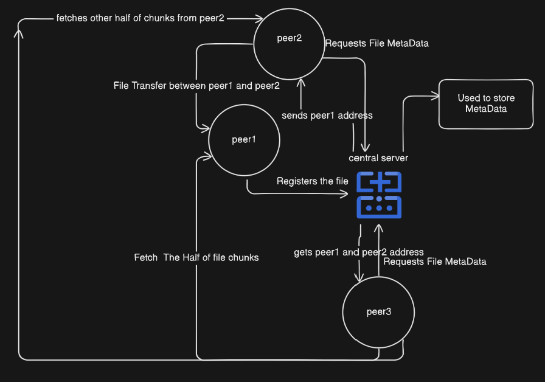

# P2P File Transfer

A robust peer-to-peer (P2P) file transfer system implemented in Go. This system enables efficient file sharing and chunk-based data transfer between peers, utilizing a central server for peer discovery and file metadata management.

## Demo Video


https://github.com/user-attachments/assets/3b65dd09-d095-45a4-b02b-70066972c140


## Architectural Diagram


## Features

- **Peer Discovery**: Utilizes a central server for dynamic peer discovery and registration.
- **Chunk-Based File Transfer**: Files are divided into chunks for efficient transfer and storage.
- **Concurrent Transfers**: Supports concurrent chunk downloads to optimize transfer speed.
- **File Integrity Verification**: Ensures file integrity through hash verification.
- **Error Handling**: Robust error handling and logging for reliable operation.
- **Configurable Transport**: Supports TCP transport for peer communication.

## Installation

1. Ensure you have Go 1.16+ installed on your system.

2. Clone the repository:
    ```sh
    git clone https://github.com/yourusername/p2p-file-transfer.git
    cd p2p-file-transfer
    ```

3. Build the project:
    ```sh
    go build -o p2p-transfer
    ```

## Usage

### Starting the Central Server

The central server manages peer registration and file metadata. Start it with:

```sh
./p2p-transfer central-server --addr <address:port>
```

### Starting a Peer Server

A peer server handles file requests and transfers. Start it with:

```sh
./p2p-transfer peer-server --central-server-addr <central-server-address:port> --addr <peer-address:port>
```

### Registering a File

To make a file available for sharing:

```sh
./p2p-transfer register-file --path <file-path> --peer-addr <peer-address:port>
```

### Requesting a File

To download a file from the network:

```sh
./p2p-transfer request-file --file-id <file-id> --peer-addr <peer-address:port>
```

## Command-Line Interface (CLI)

The application uses a CLI for system interaction. Available commands:

- `central-server`: Launches the central server.
- `peer-server`: Starts a peer server.
- `register-file`: Registers a file with the network.
- `request-file`: Initiates a file download from the network.

Each command has its own set of flags and options for configuration.

### Examples

Starting the central server:
```sh
./p2p-transfer central-server --addr 127.0.0.1:8000
```

Starting a peer server:
```sh
./p2p-transfer peer-server --central-server-addr 127.0.0.1:8000 --addr 127.0.0.1:8001
```

Registering a file:
```sh
./p2p-transfer register-file --path /path/to/file.txt --peer-addr 127.0.0.1:8001
```

Requesting a file:
```sh
./p2p-transfer request-file --file-id <file-id> --peer-addr 127.0.0.1:8001
```

## Project Structure

- `pkg/`: Core package for message types and peer management.
- `peer/`: Peer server logic and file handling functions.
- `centralserver/`: Central server logic for peer registration and metadata management.
- `cmd/`: CLI commands for system interaction.

## TODOs and Future Improvements

1. **Enhanced CLI**:
   - Implement interactive mode for easier system navigation.
   - Add command autocompletion for improved user experience.
   - Incorporate progress bars for file transfers.

2. **Improved Fault Tolerance**:
   - Implement automatic peer reconnection on network failures.
   - Add data redundancy to mitigate peer unavailability.
   - Develop a mechanism for resuming interrupted downloads.

3. **Security Enhancements**:
   - Implement end-to-end encryption for file transfers.
   - Add user authentication and authorization.

4. **Performance Optimizations**:
   - Implement adaptive chunk sizing based on network conditions.
   - Optimize peer selection algorithm for faster downloads.

5. **Extended Functionality**:
   - Add support for directory transfers.
   - Implement a web interface for easier file management.
   - Develop mobile applications for on-the-go file sharing.

6. **Testing and Documentation**:
   - Increase unit test coverage.
   - Create comprehensive API documentation.
   - Develop integration and stress tests.

## Contributing

Contributions are welcome! Please follow these steps:

1. Fork the repository.
2. Create a new branch: `git checkout -b feature-branch-name`.
3. Make your changes and commit them: `git commit -m 'Add some feature'`.
4. Push to the branch: `git push origin feature-branch-name`.
5. Submit a pull request.

